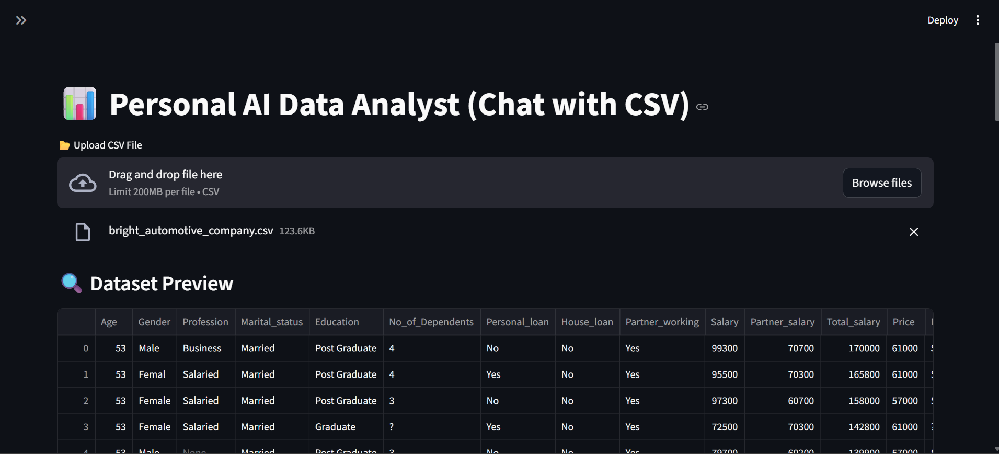
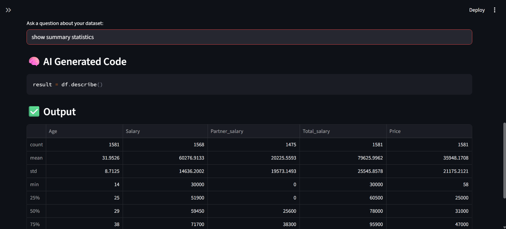

# 📊 Personal AI Data Analyst (Chat with Data)

A Streamlit-based AI Data Analyst tool that allows users to upload a CSV file and ask questions in natural language.
The app generates **Pandas + Matplotlib** code using an LLM and executes it to provide insights, tables, and charts.

---

## 🚀 Features
✅ Upload CSV and preview dataset  
✅ Ask questions in natural language  
✅ AI generates executable Pandas/Matplotlib code  
✅ Captures outputs and displays results in Streamlit  
✅ Auto-fix retry when generated code fails  
✅ Auto Insights Report (overview + missing values + numeric summary)

---

## App Preview



---

## 🛠️ Tech Stack
- Python  
- Streamlit  
- Pandas  
- Matplotlib  
- OpenAI API  

---

## 🧪 Sample Datasets
You can test the app using sample datasets:
- `data/sample_sales.csv`
- `data/sample_waterlevel.csv`

---

## ⚙️ Installation & Run
```bash
# create venv
python -m venv venv

# activate venv (Windows)
venv\Scripts\activate

# install dependencies
pip install -r requirements.txt

# run the app
streamlit run app.py
